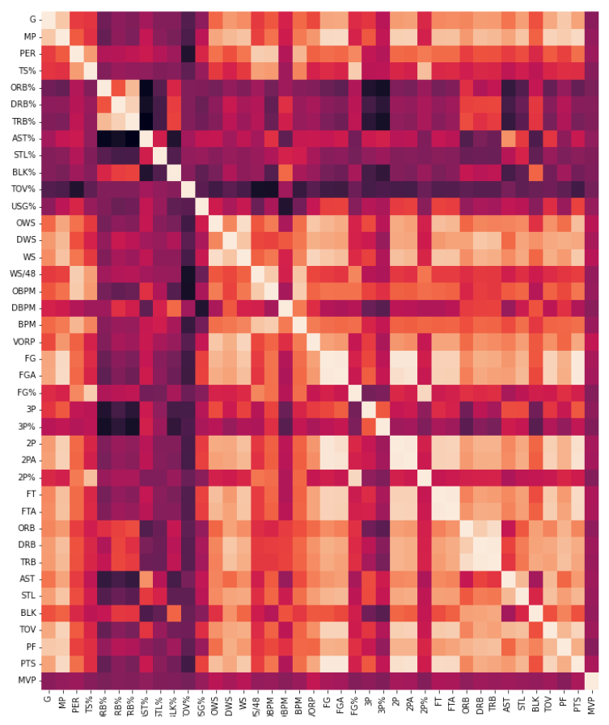
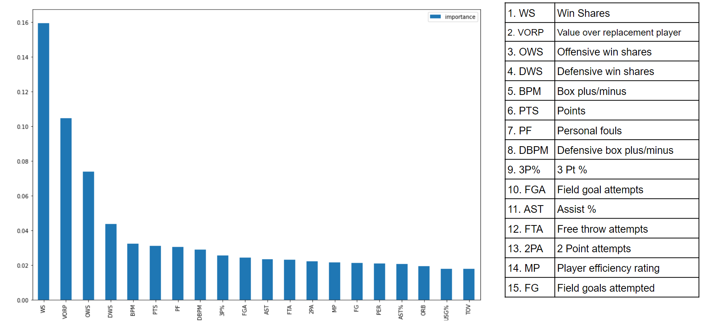
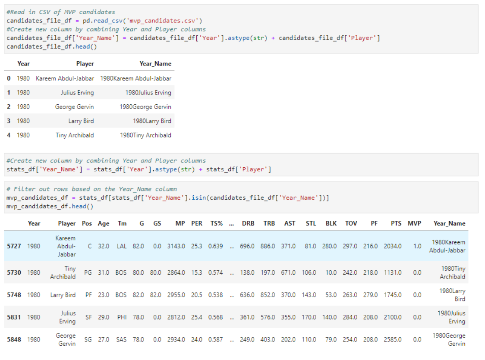
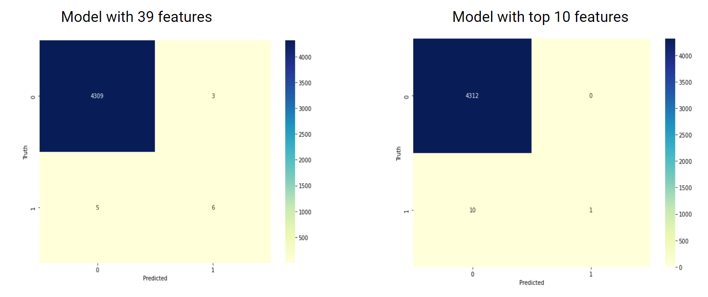
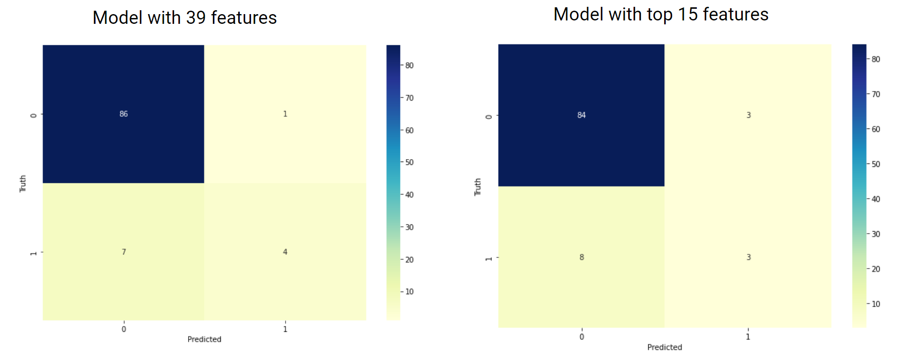
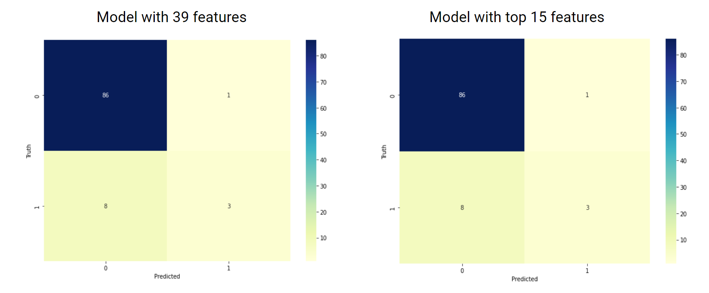

# NBA-MVP
Using Machine  Learning to Predict NBA MVP

# Project Goal

## Use machine learning to predict NBA MVP.  
Which model worked best?

## Analyze model accuracy. 
How accurate were the models? 
How do we improve upon them?

## Statistical analysis. 
Which statistics are the strongest indicators?

# Project Scope

Dataset used is NBA statistical data from 1979-2017
(1979-1980 season is introduction of 3-point shot)

Data collected from Kaggle  
CSV file scraped from basketball-reference.com

Machine learning models applied:  
- Neural Network 
- Logistic Regression

# Data Exploration

Created heatmap to select which columns to use as features, based on correlation 

Used RandomForestClassifier to discover most impactful features
 

## Aimed to improve prediction accuracy by reducing the dataset

Filtered the top 10 MVP candidates for each individual season.
As opposed to the total pool of 450-500 players

# Data Analyis Results

## Logistic Regression with all data

## Nueral Network with all data

## Logistic Regression with just MVP candidates

## Nueral Network with just MVP candidates

# Conclusion

Which machine learning model was best? 
Overall Logistic Regression was best at predicting the MVP.

Are more features better? 
Except for Logistic Regression model where we passed in all the player data and all the features, more features did better than when only the top 15 features were used.

Is more data better? 
For Logistic Regression the results were about the same. But for Nueral Networks using more data gave the best results.
